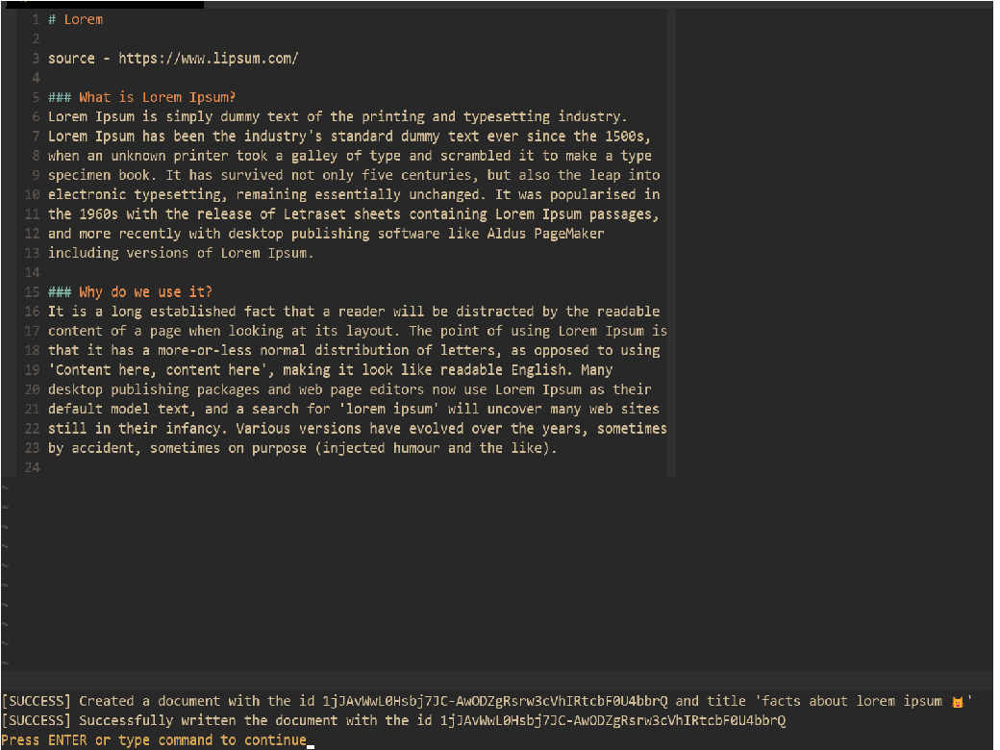

# Gdoc.vim

Google docs integration for vim/neovim.

## Features

This is a WIP and a bare bones implementation currently you can :-
- Create documents with your buffer contents.

## Installation

### Requirements

**Make sure you have the following**

- python >= 3.6 (including pip)
- vim 8+ with +python or +python3
- **for neovim users** pynvim `pip install pynvim`

Depending on your plugin manager, you need to run 'install.py' which is the install script. if any of these commands don't work try putting sudo.

**for vim-plug**

```sh
~/.vim/plugged/gdoc.vim/install.py
```

### Initializing the app

For this to work, you need to have a google account, then you need to create a new google cloud project.
[Creating a google cloud project](https://developers.google.com/workspace/guides/create-project)

Then To initialize the app, you have to activate `drive api` and `google docs` api from
[Google api dashboard](https://console.cloud.google.com/apis/dashboard)

After this, you need to download credentials, do the steps necessary to setup a consent screen and an
oAuth login, then download the credentials and place them anywhere you like. Then put the path of
the credentials in the `g:path_to_creds`. In the example below, `credentials.json` is placed in `~/.vim`

```vim
let g:path_to_creds = '/home/aadv1k/.vim/credentials.json'
let g:token_directory = '/home/aadv1k/.vim/'
```

The `g:token_directory` is where token for your api should live, if you don't want the oAuth screen
to pop-up everytime, you should set a standard directory to place the token.

## Usage

`:Gdoc filename can be as long as you like`

By default, a new instance of the app is initialized every time on start up, this leads to a slight
time delay, but a faster document creation time. You can disable this by setting `g:disable_startup`
to `1`

```vim
let g:disable_startup = 1
```

doing this, will remove the delay, instead it will add it to `:Gdoc`.

## Screenshots


