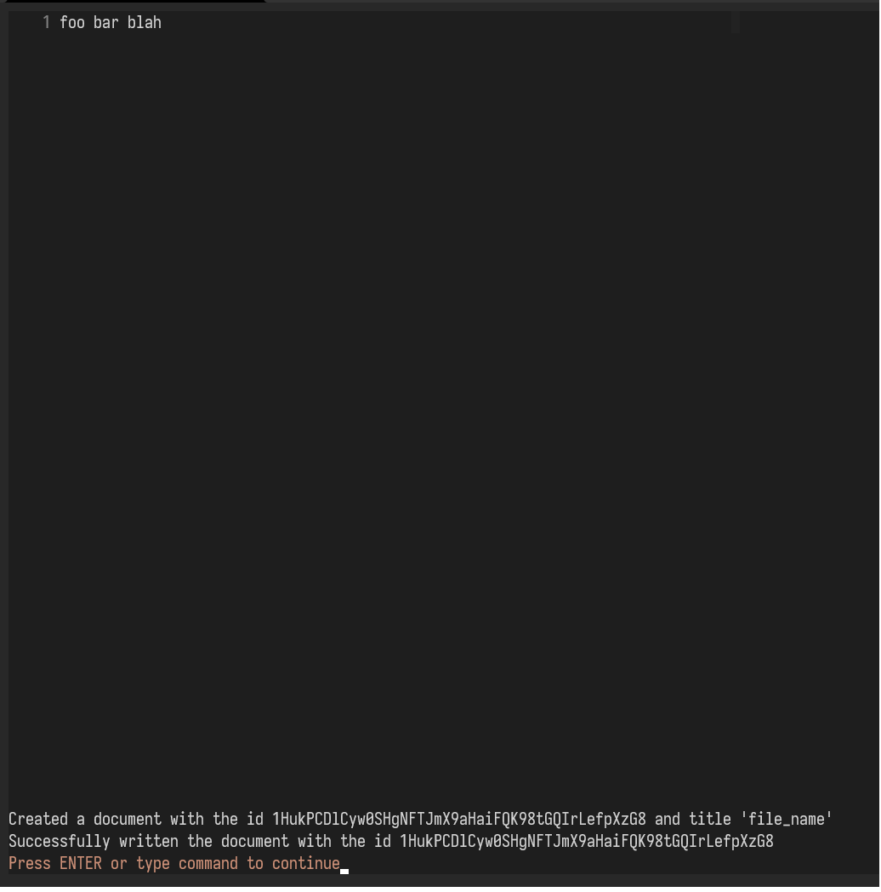

# Gdoc.vim
Google docs integration for vim.

## Features
This is a WIP and a bare bones implementation currently you can :- 
- Create documents with your buffer contents.

## USAGE
Navigate to the plugin directory and do
```shell
$ pip install -r requirements.txt
```

To initialize the app, you have to activate `drive api` and `google docs` api from
[Google api dashboard](https://console.cloud.google.com/apis/dashboard)

then, place your credentials anywhere you like, and copy the path. in the example below, credentials
are placed in `~/.vim`

```vim
let g:path_to_creds = '/home/aadv1k/.vim/credentials.json'
let g:token_directory = '/home/aadv1k/.vim/'
```

The `g:token_directory` is where token for your api should live, if you don't want the oAuth screen
to pop-up everytime, you should set a standard directory to place the token.

## Screenshots

